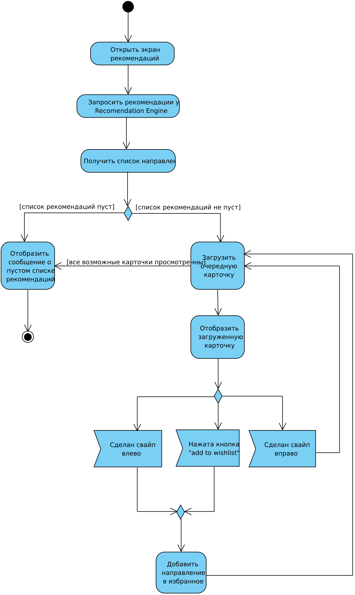
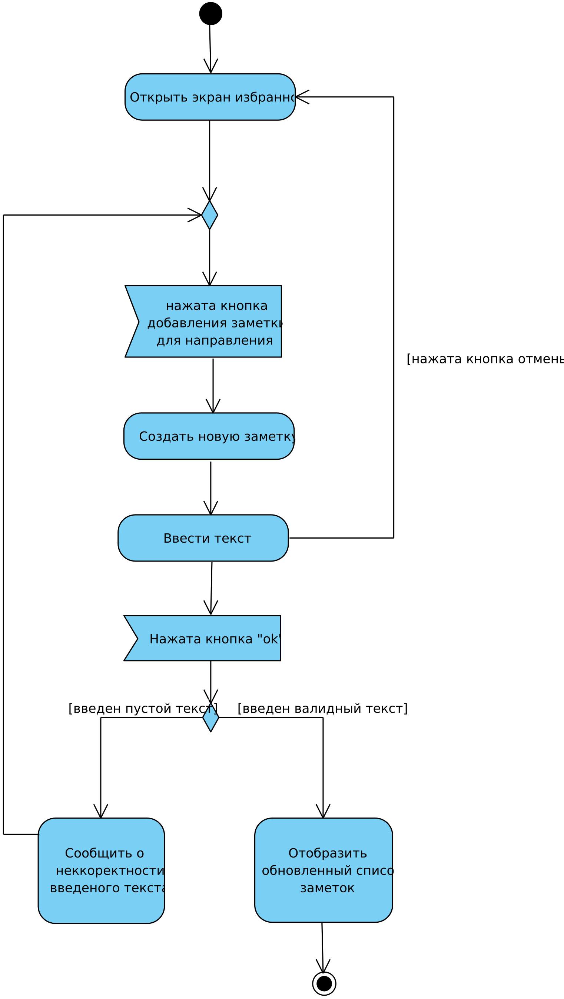
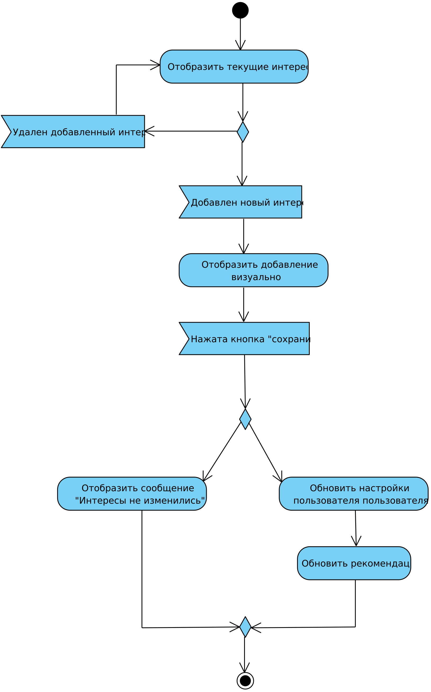

# 📊 Диаграммы активностей — TripSpark

## 📑 Содержание

1. [Просмотр рекомендаций](#1)
2. [Добавление заметки](#2)
3. [Изменение интересов](#3)

---

### 1. Просмотр рекомендаций

---

### 2. Добавление заметки

---

### 3. Изменение интересов

