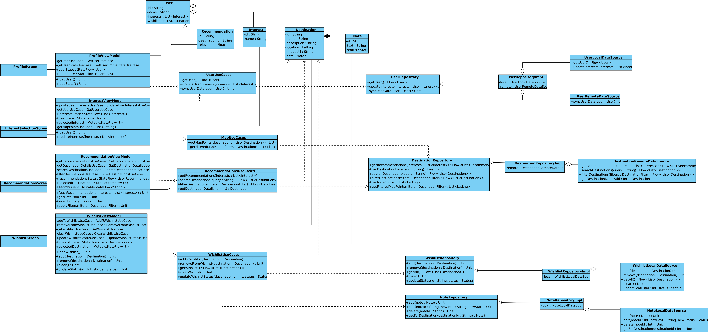

# Диаграмма классов

## Глоссарий

| Понятие              | Описание                                                                 |
|----------------------|--------------------------------------------------------------------------|
| **Пользователь**     | Человек, использующий приложение для получения туристических рекомендаций |
| **Интерес**          | Тематическая категория, отражающая предпочтения пользователя (например, природа, архитектура) |
| **Направление**      | Туристическое место, рекомендованное пользователю                        |
| **Карточка направления** | UI-элемент, отображающий информацию о направлении                        |
| **Wishlist**         | Список направлений, сохранённых пользователем                            |
| **Заметка**          | Комментарий или статус, добавленный пользователем к направлению          |
| **Карта интересов**  | Интерактивная карта с точками, соответствующими интересам пользователя    |
| **Рекомендация**     | Сгенерированное направление, соответствующее интересам пользователя       |
| **Профиль**          | Информация о пользователе и его активности в приложении                   |
| **Свайп**            | Жест пролистывания карточки направления влево или вправо для выбора или отклонения |
| **Статус направления** | Метка, отражающая текущее состояние направления (например, «в планах», «посещено») |
