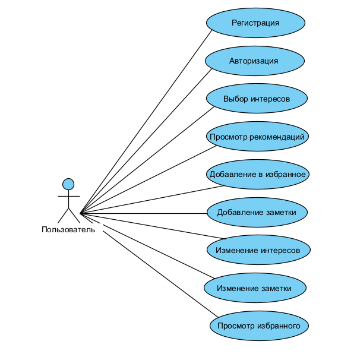

# 📘 Диаграмма вариантов использования — TripSpark

## 📚 Глоссарий

| Термин                     | Определение                                                                 |
|---------------------------|------------------------------------------------------------------------------|
| Пользователь              | Человек, использующий приложение                                            |
| Посетитель                | Пользователь, использующий приложение без авторизации                      |
| Направление               | Туристическое место, доступное для просмотра, добавления в избранное и создания заметок |
| Заметка                   | Текстовое описание, связанное с направлением                                |
| Избранное                 | Список направлений, сохранённых пользователем                               |
| Рекомендации              | Персонализированные направления, предлагаемые системой                      |

---

## 📑 Содержание

1 Актёры  
2 Варианты использования  
2.1 Войти в свою учётную запись  
2.2 Зарегистрироваться  
2.3 Войти как посетитель  
2.4 Просмотреть список направлений  
2.5 Просмотреть информацию о направлении  
2.6 Добавить направление в избранное  
2.7 Удалить направление из избранного  
2.8 Добавить заметку к направлению  
2.9 Изменить заметку  
2.10 Просмотреть рекомендации  
2.11 Изменить интересы  
2.12 Выйти из учётной записи  

---

## 🎭 1 Актёры

| Актёр                     | Описание                                                                    |
|---------------------------|------------------------------------------------------------------------------|
| Пользователь              | Человек, использующий приложение                                            |
| Посетитель                | Пользователь, который использует приложение без регистрации                 |
| Recommendation Engine     | Внутренний сервис, предлагающий направления на основе интересов            |

---

## 🎬 2 Варианты использования

### 2.1 Войти в свою учётную запись

**Описание:** Позволяет пользователю авторизоваться.  
**Предусловия:** Выбран способ "Sign in".

**Основной поток:**
- Приложение отображает окно входа;
- Пользователь вводит email и пароль;
- Приложение проверяет данные;
- Присваивает статус "зарегистрирован";
- Переход на главный экран.

**Альтернативный поток А1:**
- Неверный пароль → сообщение об ошибке;
- Пользователь может повторить попытку или отменить.

---

### 2.2 Зарегистрироваться

**Описание:** Создание новой учётной записи.  
**Предусловия:** Выбран способ "Sign up".

**Основной поток:**
- Приложение отображает окно регистрации;
- Пользователь вводит email и пароль;
- Приложение проверяет уникальность email;
- Создаёт профиль;
- Присваивает статус "зарегистрирован";
- Переход к выбору интересов.

**Альтернативный поток А2:**
- Email уже используется → сообщение об ошибке;
- Запрос нового email.

---

### 2.3 Войти как посетитель

**Описание:** Использование приложения без регистрации.  
**Предусловия:** Выбран способ "Sign in as visitor".

**Основной поток:**
- Приложение присваивает статус "посетитель";
- Переход на экран направлений.

---

### 2.4 Просмотреть список направлений

**Описание:** Отображение всех доступных направлений.  
**Предусловия:** Пользователь вошёл в приложение.

**Основной поток:**
- Приложение загружает список направлений;
- Отображает их в виде карточек;
- Если список пуст — выполняется А3.

**Альтернативный поток А3:**
- Приложение сообщает об отсутствии направлений.

---

### 2.5 Просмотреть информацию о направлении

**Описание:** Отображение подробной информации.  
**Предусловия:** Пользователь нажал на карточку направления.

**Основной поток:**
- Приложение получает ID направления;
- Загружает описание, фото, рейтинг;
- Отображает на отдельном экране.

---

### 2.6 Добавить направление в избранное

**Описание:** Сохранение направления в личный список.  
**Предусловия:** Пользователь авторизован.

**Основной поток:**
- Пользователь нажимает "add to wishlist";
- Приложение добавляет направление в избранное;
- Обновляет состояние кнопки.

**Альтернативный поток А4:**
- Ошибка сети → сообщение "Не удалось сохранить".

---

### 2.8 Удалить направление из избранного

**Описание:** Удаление направления из избранного.  
**Предусловия:** Направление уже добавлено.

**Основной поток:**
- Пользователь нажимает "Delete";
- Приложение удаляет направление;
- Обновляет список избранного.

---

### 2.9 Добавить заметку к направлению

**Описание:** Создание текстовой заметки.  
**Предусловия:** Открыт экран направления.

**Основной поток:**
- Пользователь нажимает "Добавить заметку";
- Вводит текст;
- Приложение сохраняет заметку;
- Отображает её в списке.

**Альтернативный поток А5:**
- Пустой текст → сообщение "Заметка не может быть пустой".

---

### 2.10 Изменить заметку

**Описание:** Редактирование существующей заметки.  
**Предусловия:** Заметка уже создана.

**Основной поток:**
- Пользователь выбирает заметку;
- Нажимает "Редактировать";
- Вносит изменения;
- Приложение сохраняет обновлённую версию.

---

### 2.11 Просмотреть рекомендации

**Описание:** Получение персональных направлений.  
**Предусловия:** Пользователь выбрал интересы.

**Основной поток:**
- Приложение запрашивает рекомендации;
- Получает список от Recommendation Engine;
- Отображает направления.

**Альтернативный поток А6:**
- Нет рекомендаций → сообщение "Пока ничего не найдено".

---

### 2.12 Изменить интересы

**Описание:** Обновление предпочтений пользователя.  
**Предусловия:** Пользователь авторизован.

**Основной поток:**
- Пользователь открывает настройки;
- Изменяет интересы;
- Приложение сохраняет изменения;
- Обновляет рекомендации.

---

### 2.13 Выйти из учётной записи

**Описание:** Завершение сессии.  
**Предусловия:** Пользователь нажал "Выйти".

**Основной поток:**
- Приложение завершает сессию;
- Возвращает пользователя на экран входа.

---
