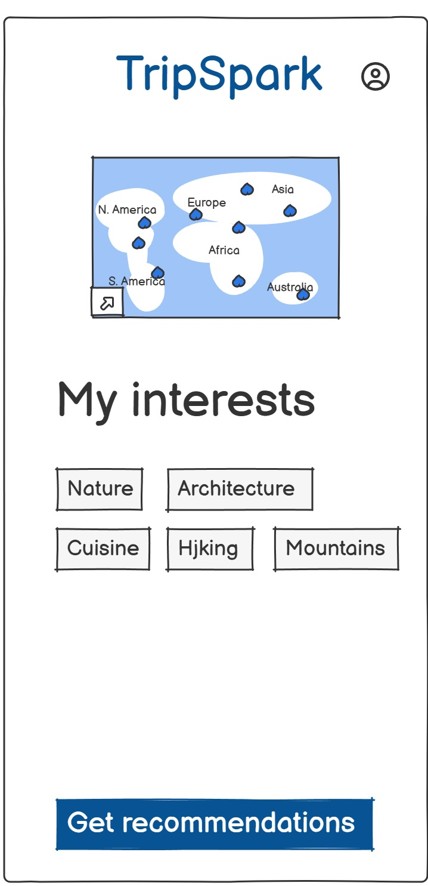
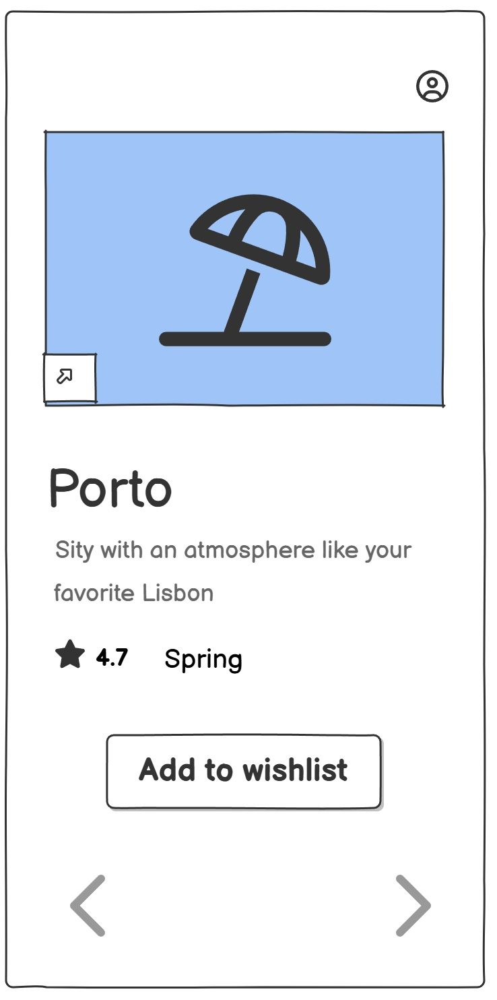
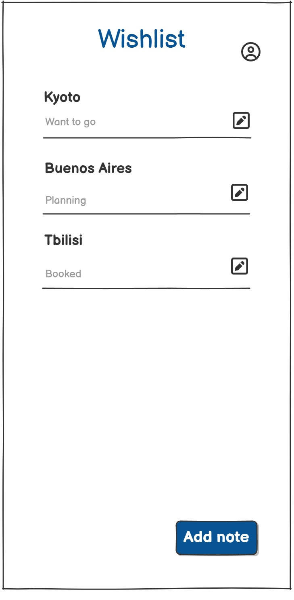
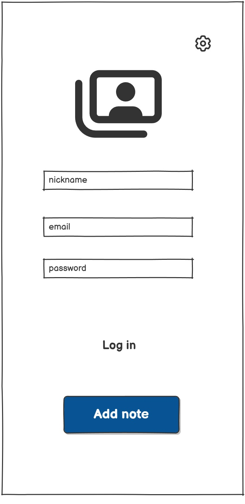

# 📱 Требования к проекту: TripSpark

## 📑 Содержание

### 1 [Введение](#1-введение)  
- [1.1 Назначение](#11-назначение)  
- [1.2 Бизнес-требования](#12-бизнес-требования)  
  - [1.2.1 Исходные данные](#121-исходные-данные)  
  - [1.2.2 Возможности бизнеса](#122-возможности-бизнеса)  
  - [1.2.3 Границы проекта](#123-границы-проекта)  
- [1.3 Аналоги](#13-аналогии)  

### 2 [Требования пользователя](#2-требования-пользователя)  
- [2.1 Программные интерфейсы](#21-программные-интерфейсы)  
- [2.2 Интерфейс пользователя](#22-интерфейс-пользователя)  
- [2.3 Характеристики пользователей](#23-характеристики-пользователей)  
  - [2.3.1 Классы пользователей](#231-классы-пользователей)  
  - [2.3.2 Аудитория приложения](#232-аудитория-приложения)  
    - [2.3.2.1 Целевая аудитория](#2321-целевая-аудитория)  
    - [2.3.2.2 Побочная аудитория](#2322-побочная-аудитория)  
- [2.4 Предположения и зависимости](#24-предположения-и-зависимости)  

### 3 [Системные требования](#3-системные-требования)  
- [3.1 Функциональные требования](#31-функциональные-требования)  
  - [3.1.1 Основные функции](#311-основные-функции)    
  - [3.1.2 Ограничения и исключения](#312-ограничения-и-исключения)  
- [3.2 Нефункциональные требования](#32-нефункциональные-требования)  
  - [3.2.1 Атрибуты качества](#321-атрибуты-качества)  
    - [3.2.1.1 Требования к удобству использования](#3211-требования-к-удобству-использования)  
    - [3.2.1.2 Требования к безопасности](#3212-требования-к-безопасности)  
    - [3.2.1.3 Требования к доступности](#3213-требования-к-доступности)  
  - [3.2.2 Внешние интерфейсы](#322-внешние-интерфейсы)  
  - [3.2.3 Ограничения](#323-ограничения)

---

## 1. Введение

### 1.1 Назначение
Документ описывает требования к мобильному приложению TripSpark, предназначенному для персонализированных рекомендаций туристических направлений. Цель — предоставить пользователю удобный инструмент для планирования путешествий на основе его интересов.

### 1.2 Бизнес-требования

#### 1.2.1 Исходные данные
Рост интереса к самостоятельному планированию путешествий, популярность мобильных приложений и запрос на персонализацию.

#### 1.2.2 Возможности бизнеса
- Привлечение аудитории 18–35 лет
- Потенциальная монетизация через премиум-функции
- Расширение функционала в будущем (например, маршруты, бронирование)

#### 1.2.3 Границы проекта
- Только Android-приложение
- Без интеграции с внешними API авиакомпаний и отелей
- Без построения маршрутов

### 1.3 Аналоги
- CultureTrip
- Roadtrippers
- Google Travel (частично)
TripSpark отличается фокусом на интересах и визуальной карте желаний.

---

## 2. Требования пользователя

### 2.1 Программные интерфейсы
- Jetpack Compose (UI)
- Room (локальная БД)
- Retrofit (внешние API — опционально)
- Coil (загрузка изображений)
- Google Maps SDK
- Firebase (аналитика, crashlytics, авторизация — опционально)

### 2.2 Интерфейс пользователя

Пользователь может:
- Выбрать интересы
- Получить рекомендации
- Свайпать карточки направлений
- Добавлять направления в wishlist
- Просматривать карту интересов
- Вести заметки по направлениям
- Управлять профилем

#### Экран выбора интересов

На этом экране пользователь отмечает свои предпочтения (природа, архитектура, гастрономия и т.д.), которые будут использоваться для генерации персонализированных рекомендаций.

#### Экран рекомендаций

После выбора интересов пользователь переходит к экрану с карточками направлений. Каждую карточку можно свайпнуть, просмотреть подробности и добавить в wishlist.

#### Экран wishlist

Здесь отображаются все сохранённые направления. Пользователь может добавлять заметки, менять статус (например, "в процессе планирования", "посещено") и удалять элементы.

#### Экран профиля

Экран профиля содержит информацию о пользователе, настройки приложения, а также статистику по сохранённым направлениям и интересам.

### 2.3 Характеристики пользователей

#### 2.3.1 Классы пользователей
- Активные путешественники
- Планирующие отпуск
- Любители эстетики и карт

#### 2.3.2 Аудитория приложения

##### 2.3.2.1 Целевая аудитория
- Возраст: 18–35 лет
- Уверенные пользователи смартфонов
- Самостоятельно планируют поездки

##### 2.3.2.2 Побочная аудитория
- Люди старше 35 лет, интересующиеся визуальным планированием
- Студенты, изучающие географию или туризм

### 2.4 Предположения и зависимости
- Доступ к интернету
- Android 8.0+
- Интеграция с Google Services
- Приложение автономно для ключевых функций

---

## 3. Системные требования

### 3.1 Функциональные требования

#### 3.1.1 Основные функции
- Выбор интересов
- Отображение карты интересов
- Генерация рекомендаций
- Свайп карточек направлений
- Добавление направления в wishlist
- Просмотр списка желаемых поездок
- Работа в оффлайн-режиме

#### 3.1.2 Ограничения и исключения
- Нет бронирования билетов
- Нет построения маршрутов
- Нет интеграции с API авиакомпаний и отелей

### 3.2 Нефункциональные требования

#### 3.2.1 Атрибуты качества

| Атрибут           | Почему важен                             | Как измеряется                              |
|-------------------|-------------------------------------------|--------------------------------------------|
| Надёжность        | Пользователь ожидает стабильную работу   | Crash-free rate ≥ 99% (Firebase)            |
| Производительность| Быстрый отклик                           | Время отклика < 200 мс                      |
| Безопасность      | Защита пользовательских данных           | EncryptedSharedPrefs                        |
| Удобство          | Простой и интуитивный UI                 | UX-опросы, retention rate                   |
| Масштабируемость  | Возможность расширения функционала       | Модульная архитектура                       |

#### 3.2.2 Внешние интерфейсы
- Google Maps SDK
- Firebase SDK
- Retrofit (опционально)

#### 3.2.3 Ограничения
- Только Android
- Без критической зависимости от внешних API
- Без серверной части на первом этапе

